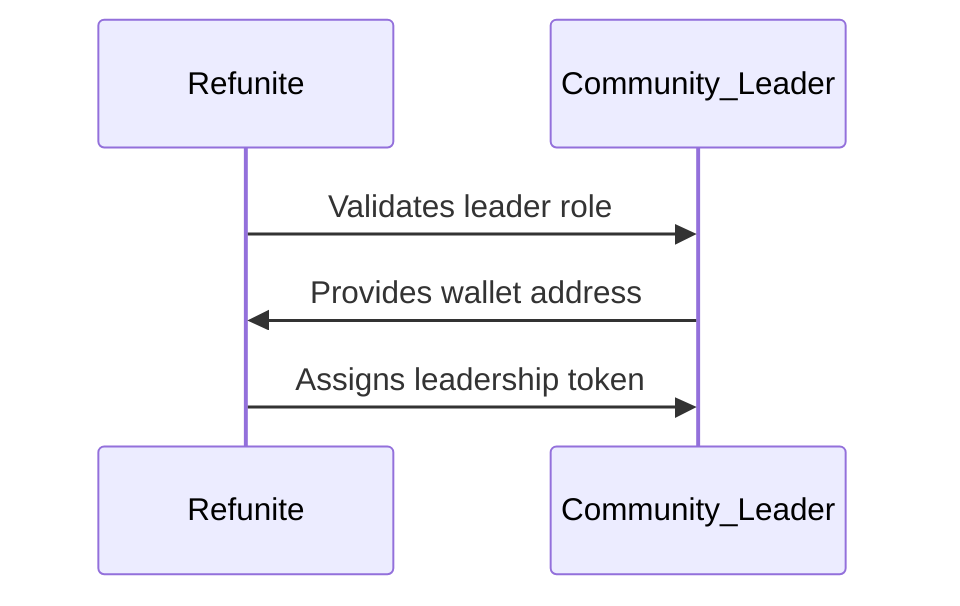
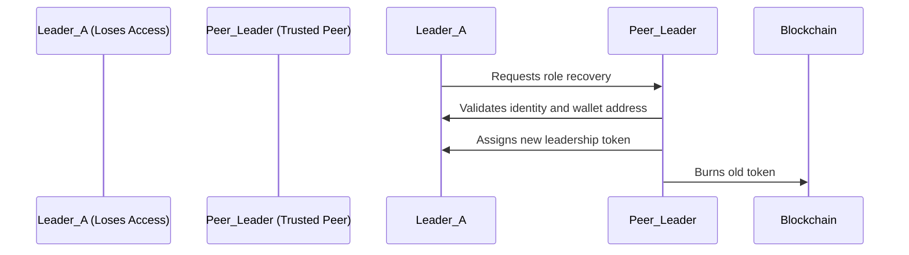

# Refunite

Refunite is the world’s largest missing persons platform designed for refugees and displaced populations. This project aims to empower Refunite’s network of over 100,000 community leaders representing 100 million members across Africa by introducing decentralized technology to support a self-managed, trust-based network.

## Table of Contents

- [Goal](#goal)
- [Features](#features)
- [Technology Stack](#technology-stack)
- [Getting Started](#getting-started)
- [User Flows](#user-flows)
- [Future Enhancements](#future-enhancements)
- [Contributing](#contributing)
- [License](#license)

## Goal

The primary goal is to create a decentralized network for community leaders within Refunite's ecosystem, enabling:

1. Onboarding of community leaders to acknowledge their role within the trust network.
2. Secure role recovery via peer-to-peer social recovery mechanisms when access is lost.

The first iteration is a pilot with leaders in Uganda, where leaders can recover their credentials from fellow Ugandan leaders.

## Features

- **Role Management**: Community leaders receive on-chain credentials through the [Hats Protocol](https://www.hatsprotocol.xyz/) to attest to their roles.
- **Social Recovery**: Leaders who lose access to their credentials can regain access through peer validation.
- **Decentralized Trust Network**: No central control over the state; managed entirely by leaders themselves.
- **Scalability**: Designed to support up to 100,000 leaders, grouped by geographic or other predefined subsets.

## Technology Stack

- **Hats protocol**: Powered by [Hats Protocol](https://www.hatsprotocol.xyz/) for role management and governance.
- **Frontend**: NextJS web application built with Web3 connectivity.
- **Silk wallet**: [Silk Wallet](https://www.silk.sc/) for Web3 connectivity.
- **Gnosis Safe**: [Gnosis Safe](https://gnosis-safe.io/) for multi-sig wallet management.
- **Blockchain**: Blockchain-based for immutable, secure credential management.

## Getting Started

### Prerequisites

- [Node.js](https://nodejs.org/)
- [Silk Wallet](https://semaphore.pse.dev/)

### Installation

1. Clone the repository:

   ```bash
   git clone https://github.com/syntro-fi/refunite-network.git
   cd refunite-network
   ```

2. Install dependencies:

   ```bash
   bun install
   ```

3. Run the application:

   ```bash
   bun dev
   ```

4. Open in your browser at `http://localhost:3000`.

## User Flows

### 1. Role Onboarding



### 2. Role Recovery



## Future Enhancements

    1.	Self-Curation: Empower leaders to onboard new members autonomously, further decentralizing control.
    2.	Privacy Layer: Introduce zero-knowledge proof (ZKP) technology (e.g., Semaphore) to obfuscate user data on-chain for increased privacy.
    3.	Enhanced UI/UX: Streamline user interactions for better accessibility to non-technical users.
    4.	Expanded Governance: Support varied governance models with flexible voting quorums (e.g., 1-of-n, n-of-n) for approvals.

## Contributing

Refunite welcomes contributions! Please open an issue to discuss any proposed changes or submit a pull request.

## License

This project is licensed under the MIT License.
